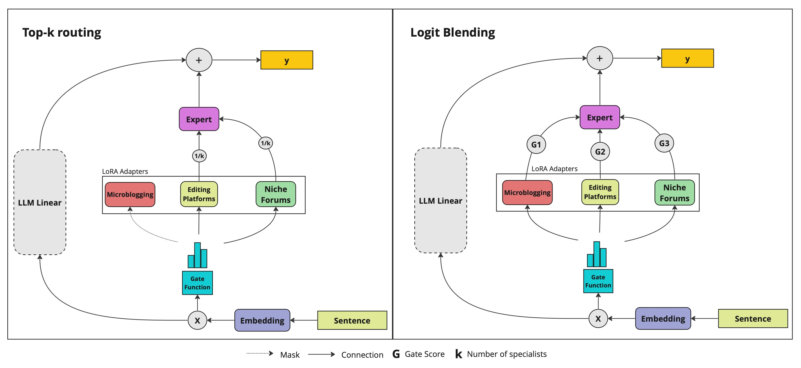

# ExplainingHate-OptimalQLoRA



## Table of Contents
- [Introduction](#introduction)
- [Installation](#installation)
- [Usage](#usage)
- [Dataset](#dataset)
- [License](#license)

## Introduction

This is the Github Repo for Explaining Hate: Optimal Detection and Characterization of Hate-Speech using Dynamically Weighted QLoRA LLMs.

Abstract:

This study introduces a hate speech detection framework integrating the expansive capabilities of large language models (LLMs) with Low Rank (LoRA) adapters, enhancing system flexibility, customizability, and explainability. It addresses the challenge of subjective content analysis, valuing annotator disagreement and the diversity of data sources as critical to refining detection accuracy. Through the implementation of dynamic weight allocation (gating methods) and Quantized LoRA (QLoRA) adapters, the framework is tailored to various datasets and their annotator biases, achieving accuracy enhancements across multiple platforms. Leveraging the architecture of Meta's Llama 2 7B model, our methodology incorporates specialized hate speech detection capabilities via QLoRA, resulting in notable performance efficiencies with reduced computational requirements. Empirical evaluations across a spectrum of datasets, including HateXplain, niche forums like Stormfront, and collaborative platforms akin to Wikipedia, affirm the model's enhanced performance.

## Installation

To download and use the code please run the following command in the console/terminal:

```git clone https://github.com/akejay526/ExplainingHate-OptimalQLoRA.git```

Following this, install the required packages with 

```pip install -r requirements.txt```

## Usage

Please note, to run this code you will need access to Meta's Llama2 7B model, available through Huggingface

To train a new QLoRA on our available data/prompt, please run the below command:

```
python3 train.py --hf_token <your huggingface token> \
      --data_path ./data/forum_df.json \
      --num_train_epochs 1 \
      --per_device_train_batch_size 8 \
      --lr_scheduler_type cosine \
      --optim paged_adamw_32bit \
      --warmup_ratio 0.03 \
      --gradient_accumulation_steps 1\
      --learning_rate 0.0004 \
```

To run inference, the following command can be used

```
python3 inference.py --hf_token <your huggingface token> \
    --eval_str <the string you would like evaluated> \
    --temperature 0.7 \
    --max_new_tokens 200 \
    --top_p 0.9 \
    --num_return sequences 1
```


Note the default routing method is logit blending for inference, if you want to use top-k blending then you can use a command such as the one below:

```
python3 inference.py --hf_token <your huggingface token> \
    --top_2_routing True \
    --eval_str <the string you would like evaluated> \
    --temperature 0.7 \
    --max_new_tokens 200 \
    --top_p 0.9 \
    --num_return sequences 1
```

# Dataset

We make publicly available two different datasets that we used for training: Our microblogging platforms dataset, collected by (Davidson et al., 2017, Mathews et al., 2022) with annotations added by GPT4, and our Collaborative editing platforms dataset, collected by Jigsaw and Conversational AI (Cjadams et al., 2017). We cannot make the data and annotations from the niche forums platform (Pastrana et al., 2018) our agreement with Cambridge University prohibits public sharing of this data. 

## License

This work is licensed under a [Creative Commons Attribution 4.0 International License](http://creativecommons.org/licenses/by/4.0/).


